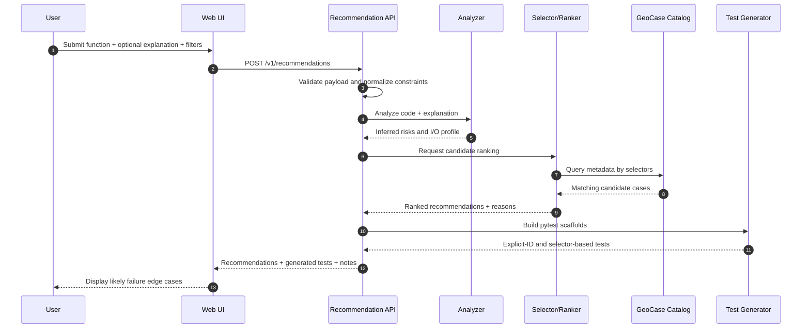

# Case Recommendation User Flow

This document explains the end-user experience for the GeoCase recommendation service:

- user submits a geospatial function,
- service analyzes likely failure risks,
- service suggests edge cases,
- service generates test scaffolds.

## Product intent

The user should not need to know case IDs in advance.

They provide:

- function code,
- optional explanation of expected behavior,
- optional constraints (vector/raster, format, geometry type).

The service returns:

- likely failure edge cases,
- reasons for each recommendation,
- generated pytest tests ready to run.

---

## End-user journey (UI)

## Step 1: Submit function

User pastes code or uploads file.

Fields:

- `language` (e.g., python)
- `function_name` (optional)
- `source_code`
- `explanation` (optional plain-language context)

## Step 2: Add optional scope filters

User can narrow recommendations by:

- `category` (`vector`, `raster`, `netcdf`)
- `geometry_type` (e.g., `Polygon`, `Point`)
- `format` (e.g., `GeoJSON`, `GeoTIFF`)
- `test_tier` / `storage_class` (optional)

## Step 3: Review recommended edge cases

Service returns ranked list:

- case ID
- confidence score
- why this case was selected (`matched_on`, inferred risk)

User can accept all or pick subset.

## Step 4: Generate tests

For selected cases, service provides:

- explicit case-id tests (`@pytest.mark.geocase_case(...)`), and/or
- selector-based tests (`@pytest.mark.geocase_select(...)`).

## Step 5: Run and inspect outcomes

User runs generated tests locally or in CI.

Service can optionally ingest outcomes to improve future ranking.

---

## Backend pipeline (behind the scenes)

The sequence below shows how a single recommendation request moves through the system.



## 1) Input validation

- Validate payload schema.
- Enforce size limits for source text.
- Normalize selector constraints.

## 2) Function analysis

- Parse code for geospatial operations (CRS transforms, nodata masking, topology ops).
- Parse explanation for risk hints (dateline, reprojection, holes, encoding).
- Infer probable I/O profile (vector vs raster).

## 3) Candidate selection

- Apply hard filters first (`category`, `geometry_type`, `format`, etc.).
- Pull candidate set from GeoCase catalog metadata.

## 4) Risk scoring and ranking

- Score cases by overlap on `risk_types_any`, `tags_any`, and inferred risks.
- Rank descending by score.
- Use deterministic tie-breaking.

## 5) Explanation generation

- For each recommendation, emit `matched_on` + plain-language reason.

## 6) Test scaffold generation

- Build pytest snippets with either explicit IDs or selectors.
- Include a baseline assertion template.

## 7) Response packaging

Return:

- ranked recommendations,
- test snippets,
- caveats/notes,
- traceable request ID.

---

## Recommended output structure

```json
{
  "request_id": "rec_01...",
  "resolved_selectors": {
    "category": "vector",
    "geometry_type": "Polygon"
  },
  "recommendations": [
    {
      "case_id": "dateline_crossing_polygon",
      "score": 0.94,
      "matched_on": ["risk_types_any", "geometry_type"],
      "reason": "Function appears sensitive to coordinate wrapping near antimeridian."
    }
  ],
  "generated_tests": {
    "explicit": "@pytest.mark.geocase_case(\"dateline_crossing_polygon\")\ndef test_recommended_case(geocase):\n    ...",
    "selector": "@pytest.mark.geocase_select(category=\"vector\", geometry_type=\"Polygon\", risk_types_any=[\"coordinate_wrapping\"])\ndef test_recommended_selector(geocase):\n    ..."
  },
  "notes": [
    "Scores are relative within this request."
  ]
}
```

---

## Operational steps to launch

## Phase A — MVP

1. Implement synchronous recommendation endpoint.
2. Use rule-based analyzer + metadata scoring.
3. Return top-k with reasons and basic pytest templates.

## Phase B — Reliability

1. Add auth, rate limiting, and structured logs.
2. Add benchmark set and quality gates (precision@k).
3. Add fallback behavior when filters produce no candidates.

## Phase C — Production

1. Add caching by function fingerprint + constraints.
2. Add dashboards (latency, recommendation acceptance, drift).
3. Add versioned ranking logic and rollback controls.

## Phase D — Learning loop

1. Capture user-selected recommendations and test outcomes.
2. Tune ranking weights.
3. Optionally add LLM-assisted risk inference.

---

## UX principles

- **Explainability first**: every recommendation must include clear reason.
- **Low friction**: user should get useful output with minimal inputs.
- **Determinism**: same input should produce stable recommendations.
- **Safety**: minimize source-code retention and protect sensitive data.

This flow keeps GeoCase approachable while still giving power users precise, testable recommendations.
